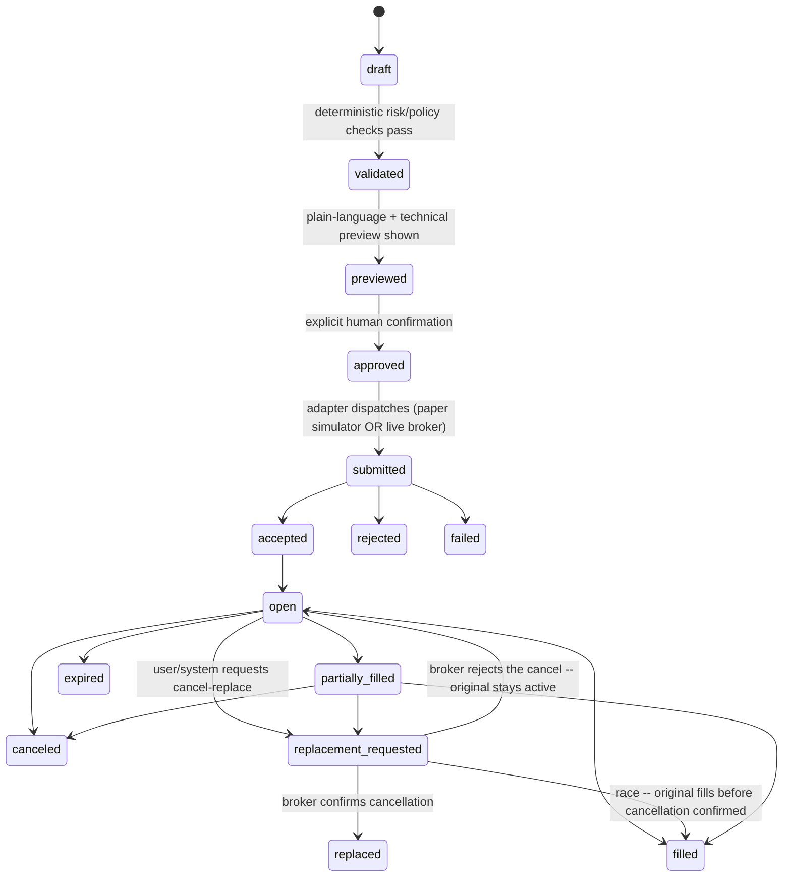

# FORGE Trading: Architecture and Phased Plan

**Status:** Planning package only. No product code, migration, or UI was written to produce this
document. Nothing here was committed, pushed, deployed, or merged. This file itself is untracked.
**Prepared:** 2026-09-10, against `origin/main` @ `9bd3edef160310b968e41826e9789dfcefcb6fd8`.
**Revised:** 2026-09-10, incorporating ChatGPT's architecture review (10 required corrections +
additional improvements + refined guardrail wording, verdict: "approve the direction, targeted
correction pass, then approve TR-0" — not a redesign).
**Companion file:** `docs/product/FORGE_TRADING_IMPLEMENTATION_HANDOFF_PROMPTS.md` (deliverable #17).

---

## 1. Executive recommendation

Build a FORGE Trading domain that starts as a **read-only, evidence-grounded investing workspace
with a teaching layer** (Phase TR-1, split into TR-1A/TR-1B — see §13), then adds a **credible
paper-trading order ledger** (TR-2) before anything resembling a live broker connection is even
discussed. This order is not just caution for its own sake — it's dictated by what the repository
audit below actually found: FORGE has no security master, no order engine, no market-data pipeline,
and no end-user-facing Brain action/approval framework today. Those are the load-bearing pieces
every later phase depends on, and none of them benefit from being built against a live brokerage
account first.

**Recommended first vertical slice to authorize: TR-1A, then TR-1B, each as its own reviewable PR**
— TR-1A: security master + delayed/EOD quotes for a small fixed symbol set + provenance + licensing
proof. TR-1B: watchlist + a research-evidence store + read-only Brain Q&A with citations + the first
3-4 lessons of the education curriculum. No paper orders yet (that's TR-2). This is deliberately
smaller and more finely sliced than the single TR-1 described in the source prompt's ladder, because
the audit found zero existing security-master or market-data infrastructure to build on — market-data
ingestion (TR-1A) is risky enough on its own to isolate from the UI/Brain/curriculum work (TR-1B), and
proving the pattern on a small symbol set first is lower-risk than building it against unbounded scope.

**What you'll be able to do once TR-1A and TR-1B both ship:** look up a small set of real symbols, see
delayed/EOD quotes with clear timestamps, save a watchlist, ask FORGE Brain plain-language questions
about a security grounded in cited primary sources (with an honest "I don't have enough evidence"
answer when sources are thin), and work through the first few lessons of the Trading Coach curriculum
with concept checks. **What remains intentionally impossible:** placing any order, paper or live;
anything touching real money; any brokerage connection.

**Largest unresolved risk:** market-data and security-master licensing. Every other open question
in this plan (§16) is something FORGE controls internally. This one depends on external vendor
terms, and it gates TR-1 itself — see the build-vs-buy matrix (§14) and Open Decision #1.

**Jason's live-pilot guardrail (TR-6), stated in full — this is the authoritative wording, referenced
elsewhere in this plan rather than re-typed in full each time:**

> Jason's controlled live pilot permits no more than $100 of aggregate real-money exposure, including
> positions, reserved open orders, unsettled purchases, and estimated fees. No leverage, margin,
> options, short selling, or automated execution. AI may propose an order; only an authenticated
> human may create, approve, and submit it. Any future change requires separate explicit
> authorization.

**Sequencing — do not let this program displace active work.** This is a multi-quarter initiative.
It must not displace Jason's unfinished rental payment-chain proof or other active production-feedback
work already underway in this repository. Recommended sequence: (1) finish and verify the active
rental/private-financing production work; (2) authorize TR-0 *planning only*; (3) start
market-data/licensing research in parallel with TR-0, since it has its own external lead time; (4)
complete the ledger-authority investigation (TR-0.5); (5) review the revised TR-1A/TR-1B scope (§13)
before authorizing any actual product implementation.

---

## 2. Recovered prior work

**Repository-wide search result: no prior trading, brokerage, paper-trading, security-master,
watchlist, or portfolio/order design artifact exists anywhere in this repository.** Searched
`docs/**/*.md`, `governance/**`, and `src/domains/**` for `trading|brokerage|e.?trade|paper.trad|
security.master|watchlist` (case-insensitive) — the only incidental hit was an unrelated substring
match in `docs/product/STRIPE_LIVE_MODE_ROLLOUT_RUNBOOK.md` (about Stripe *live mode*, nothing to
do with trading). `git ls-tree` of `src/domains/` (72 domains) and `governance/specifications/`
confirms no `security-master`, `trading`, `brokerage`, `market-data`, or `portfolio` domain exists.

This means the source prompt's premise — "earlier paper-trading research was intentionally
deferred and isolated," with a "$100 max, no leverage" guardrail already decided — **is not
recoverable from this repository**. It is not falsified either; it's simply not written down
anywhere I can find. Treat it as **a real constraint Jason is stating now**, not as a repository
fact being recovered. I'm carrying it forward exactly as instructed (§6, §12) but flagging that no
prior artifact backs it, so a future session doesn't go looking for a document that doesn't exist.

**Reuse / adapt / retire, against what actually does exist and is adjacent:**

| Found | Classification | Why |
|---|---|---|
| `investment_accounts` / `investment_account_valuations` (migration `20260826010000_add_investment_account_registry.sql`, `src/domains/financial-position/`) | **Adapt the concept, retire the RLS pattern** | This is a real, tested, production net-worth registry for investment accounts — but it's account-level dollar valuations at a point in time (manual/Simplifi/Plaid/brokerage/custodian-statement sourced), not share-level positions, lots, or orders. Its RLS is the **older** direct `owner_id = auth.uid()` pattern with `security invoker` RPCs (`create_investment_account_with_valuation` — confirmed via its own migration test asserting `v_owner_id uuid := auth.uid()` and `not toContain("security definer")`). This predates the workspace-membership/acting-user pattern used everywhere else audited below. **Do not copy its RLS shape into the new trading domain.** Do treat it as the eventual *destination* for a trading account's periodic valuation snapshot into consolidated net worth (see §8). |
| `src/domains/plaid-adapter/`, `src/domains/stripe-financial-connections-adapter/`, `src/domains/connection/` (`connection-capabilities.types.ts`) | **Reuse the pattern directly** | A real, working multi-provider connection abstraction already exists: typed capability negotiation (`CONNECTION_CAPABILITY_KEYS` — `import_accounts`, `import_balances`, `webhook_updates`, `realtime_updates`, etc.), per-provider mapper/adapter files, and `src/domains/connection-execution-history/` for audit trail. This is close to exactly the shape TR-5's broker-adapter capability negotiation needs — extend the capability key vocabulary rather than inventing a new connection abstraction. |
| `src/domains/private-financing/*` (`replayEvents.js`, `dueState.js`, `ledgerIntegrity.js`, `ledgerOrdering.js`, `financingTermsContracts.js`, `paymentDueReminders.js`, `reminderRunPlanner.js`) + its migrations (`private_financing_events` with `ledger_sequence`, RLS force-enabled, `SECURITY DEFINER` RPCs granted only to `service_role`) | **Reuse as the template, not the code** | This is the most mature, most recently battle-tested (this session independently traced and verified its production correctness multiple times) event-sourced immutable-ledger + replay pattern in the repository: append-only events, a sequence column enforcing ordering, terms-versioning with effective dates, a pure-function replay engine separate from the route/API layer, and fail-closed behavior on data it can't trust (`BorrowerSummaryUnavailableError` — added this session to replace a fallback that silently returned `$0` instead of failing closed). **This is the shape the order-event ledger (§6) and paper-fill engine (§7) should copy** — not literally reuse (money-lending events and trade-fill events are different domains), but the same architectural discipline. |
| `src/domains/ledger/` (`entities/JournalEntry.js`, `entities/Posting.js`, `entities/GeneralLedger.js`, `accounts/ChartOfAccounts.js`, `calculators/TrialBalanceCalculator.js`) | **Reuse as the posting target, needs verification** | A classical double-entry general-ledger structure exists. I have not verified how actively wired/authoritative this is versus the append-only `financial_events`/`private_financing_events` pattern used elsewhere — this needs a TR-0 spike, not an assumption. If this is the real general ledger Financial FORGE posts to, it's the natural destination for summarized trading journal entries (§8). If it's legacy/dormant scaffold, that changes the integration recommendation. **Flagged as an open decision, not assumed** (§16). |
| `src/domains/risk/` (`risk-engine.service.ts`, `risk-aggregation.service.ts`, `risk-dashboard.service.ts`, `executive-briefing.service.ts`), `src/domains/decision/` (`decision-workflow.service.ts`, `decision-outcome-evaluator.ts`), `src/domains/knowledge/` (`knowledge.types.ts`, `category-map.ts`) | **Candidate for reuse — needs deeper TR-0 review** | Names and file shapes suggest genuine overlap with Risk and Suitability Controls, the decision journal, and Research/Evidence bounded contexts. I did not read these in full depth in this audit (scope/time discipline — see the quality-bar note in §16). Do not assume their exact contracts; a TR-0 task should read and classify each one properly before TR-2/TR-3 design locks in. |
| `src/domains/engineering-brain/`, `src/app/api/forge/engineering-brain/query/route.js` | **Reuse the citation/evidence contract shape; the end-user action/approval layer does not exist yet** | Read the actual route: it's strictly a developer-facing codebase Q&A tool today — authorization via `ProgrammerAuthorizationApplication` + RLS `is_forge_programmer()`, results carry `{source_path, source_type, symbol_or_section, commit_sha, content_hash, authority_level, version}` citations, explicitly *not* general end-user financial tooling. This confirms this session's earlier memory finding: "Forge Brain" as an end-user, cross-domain, tool/action/approval-gated assistant is **planned, not built**. §9's Brain contract is genuinely new design, informed by this citation-evidence shape and by `scripts/repair-controller/`'s deny-by-default authority-ceiling pattern (independently verified multiple times this session: `AUTHORITY_CEILING_THIS_VERSION` hard-caps what the Repair Controller can do regardless of input) — that ceiling pattern is the right shape for gating Brain's "propose an order, never create or submit one" boundary (revised per ChatGPT's review, §9). |
| `src/components/forge/ForgeMetricTile.jsx`, `src/components/forge/workspace/ForgeWorkspaceTile.jsx`, `src/components/forge/financial/buildFinancialTilePresentation.js` | **Reuse directly** | Real compact-tile/workspace-tile shell components exist matching the "compact tile → expanded tile → focused workspace" model referenced in the prompt's product intent. Confirms the interface language is already established product convention, not something to invent. |
| `payment-webhook` domain + the private-financing Stripe webhook chain (`stripe-webhook/route.js`, idempotency via `payment_webhook_events`) | **Reuse directly for market-data/broker webhook ingestion later** | Already proven this session end-to-end (webhook → application event → immutable ledger → read model → view), including idempotency-under-retry and duplicate-delivery handling. This is the concrete precedent for TR-5's broker webhook/reconciliation ingestion. |

---

## 3. Current architecture map (exact paths, `origin/main` @ `9bd3edef1`)

| Concern | Path(s) | Evidence |
|---|---|---|
| Repo instructions | `CLAUDE.md` (→ `@AGENTS.md`), `AGENTS.md` | Both are generic Next.js-version-warning boilerplate (auto-regenerated by `next dev`, see `node_modules/next/dist/server/lib/generate-agent-files.js`) — **no FORGE-specific process guidance lives here**; governance/process docs live under `docs/product/` and `governance/` instead. |
| Workspace membership / acting-user audit | migrations containing `workspace_member`, `acting_user` (confirmed present via `git grep` across `supabase/migrations/*.sql`); `src/domains/identity/Identity.js`, `src/domains/permission/Permission.js` | Modern pattern, used throughout the recently-built private-financing and rental domains. |
| Financial FORGE core | `src/domains/financial-account/`, `src/domains/financial-account-group/`, `src/domains/financial-event/` (`FinancialEventGateway.js`, `FinancialEventRepository.js`, `SupabaseFinancialEventRepository.js`, `FinancialEventTranslator.js`), `src/domains/financial-position/` (`FinancialPositionQueryService.js`), `src/domains/financial-metrics/`, `src/domains/financial-insights/`, `src/domains/financial-intelligence/` | Gateway/Repository/Translator layering is the established pattern for a canonical event type; `financial-intelligence` (`FinancialForecastService.js`, `FinancialScenarioModelingService.js`) is a real candidate for reuse in Brain's scenario-analysis capability (§9) — not yet verified in depth. |
| Classical ledger | `src/domains/ledger/entities/{JournalEntry,Posting,GeneralLedger,LedgerAccount,LedgerEntry}.js`, `src/domains/ledger/accounts/ChartOfAccounts.js`, `src/domains/ledger/calculators/{BalanceCalculator,TrialBalanceCalculator}.js` | Needs a TR-0 spike to confirm current wiring/authority (see §2 table). |
| Provider connections | `src/domains/plaid-adapter/`, `src/domains/stripe-financial-connections-adapter/`, `src/domains/connection/connection-capabilities.types.ts`, `src/domains/connection-execution-history/` | Proven multi-provider capability-negotiation pattern, directly reusable for broker adapters. |
| Immutable event-ledger precedent | `src/domains/private-financing/{replayEvents,dueState,ledgerIntegrity,ledgerOrdering,financingTermsContracts,paymentAllocation}.js`, migrations `20260830000200_create_private_financing_foundation.sql` / `20260830000300_add_private_financing_v1_terms_generalization.sql` / `20260831000200_add_private_financing_stripe_payments.sql` | Verified this session: append-only events + `ledger_sequence`, `SECURITY DEFINER` RPCs granted to `service_role` only, RLS force-enabled, fail-closed fallback (`BorrowerSummaryUnavailableError`). |
| Webhook/idempotency precedent | `src/app/api/rental/stripe-webhook/route.js`, `src/domains/payment-webhook/` | Verified this session: idempotent, retry-safe, duplicate-delivery-safe, full audit trail. |
| Investment-account registry (net worth only) | `supabase/migrations/20260826010000_add_investment_account_registry.sql`, `src/domains/financial-position/investment-account-registry.migration.test.js` | Account-level valuation only; legacy RLS pattern (§2). |
| FORGE Brain (developer-only today) | `src/domains/engineering-brain/`, `src/app/api/forge/engineering-brain/query/route.js`, `scripts/engineering-brain/query/runQuery.mjs` | Citation-evidence contract confirmed; no end-user tool/action/approval layer exists yet. |
| Approval-gating precedent | `scripts/repair-controller/` (`repairContracts.mjs`, authority evaluator, `AUTHORITY_CEILING_THIS_VERSION`) | Independently verified multiple times this session; deny-by-default, structurally incapable of exceeding its ceiling regardless of input. |
| UI shells/tiles/workspace | `src/components/forge/ForgeMetricTile.jsx`, `src/components/forge/workspace/ForgeWorkspaceTile.jsx`, `src/components/forge/financial/buildFinancialTilePresentation.js` | Confirmed real, tested components matching the compact→expanded→focused product-intent language. |
| Risk / decision / knowledge (unverified depth) | `src/domains/risk/*.service.ts`, `src/domains/decision/*.ts`, `src/domains/knowledge/*.ts` | Named and shaped like real candidates; not read in full — flagged for TR-0, not assumed. |
| Test conventions / CI | No CI test workflow exists (`.github/workflows/` holds only two scheduled cron workflows — confirmed independently this session in the Phase 0 production-feedback audit); test execution is manual/agent discipline; `vitest run --exclude '**/.claude/**'` is required locally due to stale worktree directories being picked up by default globs. |
| Production verification pattern | `supabase migration list --linked`, `supabase db query --linked` (read-only) — established and used repeatedly this session for safe production verification without touching application data. |

---

## 4. Success-model comparison

| Product pattern | Lesson | FORGE adaptation | Risk/limitation |
|---|---|---|---|
| **E*TRADE Developer Platform** — REST Accounts/Market/Order APIs, OAuth 1.0a, sandbox + production ([developer.etrade.com](https://developer.etrade.com/), accessed 2026-09-10) | Broad account/order/market-data surface behind a clean REST boundary is achievable as a *broker adapter*, not FORGE's internal model. | Treat as one candidate TR-5 adapter implementation; its response shapes must be mapped into FORGE's own canonical order/position contracts (§6), never bound directly (per prompt principle #7). | OAuth 1.0a (older, more friction than OAuth2/OIDC); sandbox parity with production not independently verified here. |
| **thinkorswim paperMoney** — $100,000 virtual funds, real-time market data, explicitly "for educational purposes only," successful paper results don't guarantee live success ([schwab.com/learn/story/thinkorswim-papermoney-stock-trading-simulator](https://www.schwab.com/learn/story/thinkorswim-papermoney-stock-trading-simulator), accessed 2026-09-10) | A credible paper engine uses the *same* real-time data and tools as live trading, and explicitly disclaims outcome transfer. | Confirms §7's fill-policy realism requirement and the education contract's explicit prohibition (§10) against implying paper success predicts live success — this is industry-standard disclosure, not FORGE being unusually cautious. | Schwab's paper account still requires an approved/funded real account to open — FORGE's paper mode should NOT copy that gate; paper access should not require funding anything. |
| **Interactive Brokers paper accounts** — paper and live TWS API have "minimal functional differences," separate socket ports (7496 live / 7497 paper) but same protocol ([interactivebrokers.github.io/tws-api](https://interactivebrokers.github.io/tws-api/introduction.html), [interactivebrokers.com/docs/tws-api/.../paper-trading](https://www.interactivebrokers.com/docs/tws-api/doc/notes-limitations/limitations/paper-trading), accessed 2026-09-10) | Validates the prompt's core paper-to-live invariant: one contract, execution mode selected by which adapter/endpoint answers it — not a business-logic branch. | Directly informs §6's adapter-boundary design: FORGE's order lifecycle must be identical in both modes; only the execution adapter differs. | IBKR's own docs list explicit "notes and limitations" for paper trading (it is *not* perfectly identical) — §7 must specify FORGE's own realism gaps rather than claim perfect parity. |
| **TradingView Strategy Tester** — Overview/Performance Summary/List of Trades tabs; Sharpe, Sortino, profit factor (gross profit ÷ gross loss), equity curve, drawdown ([tradingview.com/support/solutions/43000764138](https://www.tradingview.com/support/solutions/43000764138-tradingview-strategy-report-how-to-start/), accessed 2026-09-10) | A credible replay/evaluation surface needs a small, standard set of named metrics, not a bespoke scoring system. | §15/§10 adopt these exact metric names (Sharpe, Sortino, profit factor, max drawdown, win rate) for TR-3's evaluation, and explicitly warn against overfitting/small-sample claims (already required by the source prompt). | TradingView's metrics are computed over backtest data that can still carry look-ahead bias if scripted carelessly — §7 already requires explicit look-ahead prevention; this is a reminder the *metric*, not just the *fill*, needs replay discipline. |
| **Public Alpha** — AI co-pilot grounded in SEC filings, earnings transcripts, market data, analyst material, news, sentiment; "does not provide financial advice," powered by GPT-4 but not "ChatGPT" ([help.public.com/en/articles/9354354-what-is-alpha](https://help.public.com/en/articles/9354354-what-is-alpha), accessed 2026-09-10) | Grounded research assistant with an explicit non-advice boundary, free to all users. | Directly informs §9's citation/abstention requirements; the "not financial advice" framing should appear in FORGE Brain's own disclosure pattern. | Public doesn't publicly detail its abstention/hallucination-mitigation architecture — FORGE's own deterministic-tool-boundary (§9) is a stronger, more specific commitment than what's publicly documented for Alpha. |
| **Robinhood Cortex** — AI assistant coming to Gold members, "Digests" summarizes why a stock is moving from news/analyst reports/technicals ([robinhood.com/us/en/newsroom/introducing-strategies-banking-and-cortex](https://robinhood.com/us/en/newsroom/introducing-strategies-banking-and-cortex/), announced 2025-03-27, accessed 2026-09-10) | "Why did this move?" as a distinct, separate product surface from order entry — exactly the pattern requirement 5's "why did this move" summary asks for. | §9 keeps this as a read-only research surface, explicitly separated from order drafting, matching Cortex's own separation. | Cortex is gated behind a paid tier (Gold, $5/mo) at Robinhood — FORGE has no equivalent paywall decision made; flagged only as a fact, not a recommendation, since monetization is out of scope for this plan. |
| **Magnifi** — natural-language assistant + 15,000+ security marketplace + Portfolio Health Score + scenario-testing/forecasting, free tier for account linking/viewing ([Magnifi app listings + reviews, accessed 2026-09-10](https://apps.apple.com/us/app/magnifi-invest-with-ai/id1574358920)) | Portfolio-aware natural-language queries plus a single "health score" style synthesis is a proven UX pattern for making a portfolio legible at a glance. | Informs §5B's calm-dashboard requirement — a single risk/health synthesis metric, not a wall of charts, as the default view. | I could not independently verify Magnifi's specific compliance/disclosure architecture from public app-store/review sources alone (no official developer/API documentation surfaced in this search) — treat any deeper Magnifi-pattern claim as unverified until an official source is found. |
| **Interactive Brokers Ask IBKR / "iBot"** — natural-language portfolio Q&A grounded in the user's own account data; AI drafts trade instructions in a dedicated "AI Instructions" tab; **every instruction reviewed and approved by the client before submission**; no API keys/credentials shared with or stored by the AI provider ([interactivebrokers.com/en/trading/ai-hub.php](https://www.interactivebrokers.com/en/trading/ai-hub.php), [.../ai-integrations.php](https://www.interactivebrokers.com/en/trading/ai-integrations.php), [.../ibot.php](https://www.interactivebrokers.com/en/trading/ibot.php), accessed 2026-09-10) | This is the closest real-world precedent for the exact FORGE Brain control boundary the prompt specifies: AI drafts, human reviews and submits, no credential sharing. | This is the **model for §9's approval boundary** — IBKR's "no API keys/passwords shared with the AI provider" principle maps directly onto FORGE's own credential-isolation requirement (§12): FORGE Brain must never hold or use brokerage credentials itself; only the deterministic adapter layer does, and only after the user has explicitly approved the action it's executing. | IBKR's integration works by connecting third-party general AI assistants (ChatGPT/Claude/Grok) to IBKR's own review tab — a different shape than FORGE building its own in-house Brain. The control *boundary* transfers; the *integration mechanism* does not. |

---

## 5. Target architecture

### 5.1 Bounded contexts and ownership

| Context | Owns | Projections only (elsewhere) |
|---|---|---|
| **Security Master / Instruments** | Canonical symbol identity, instrument metadata, corporate-action calendar | Everywhere else references by a stable instrument ID, never re-derives identity |
| **Market Data** | Time-stamped, provenance-tagged quotes/bars (delayed/EOD in TR-1/TR-2, provider-negotiated later) | Charts, order tickets, fill engine all read projections of this, never store their own copy of "the price" |
| **Watchlists and Alerts** | User-curated symbol lists and alert rules | — |
| **Brokerage Connections** | OAuth/token lifecycle, capability discovery, connection health (extends existing `connection`/`connection-capabilities` pattern) | — |
| **Trading Accounts** | Canonical paper/live account identity, workspace ownership, `mode` (immutable) | Portfolio Valuation reads this, does not own cash truth — cash itself is owned by Cash/Fees/Dividends/Interest below, not here |
| **Orders and Execution** | The canonical order lifecycle (§5.2) and its immutable event stream, including replacement linkage (`replaces_order_id`) | Positions/Portfolio Valuation are *derived* from filled order events, never independently mutated |
| **Positions, Lots, and Corporate Actions** | Lot-level cost basis, corporate-action adjustments (splits, dividends-in-kind) | Purely a **rebuildable projection** over filled order events + corporate actions (§6) — it does not own lot truth independently of the event stream |
| **Cash, Fees, Dividends, and Interest** | The immutable **cash-event stream** (`trading_cash_events`, §6): deposits/withdrawals, reserved buying power, unsettled proceeds, fees, dividends, interest, reversals/corrections, settlement dates | Available cash / current balance is a **derived projection** over this event stream, never an independently-mutated field. Feeds Financial FORGE posting (§8), does not itself become net-worth truth until posted |
| **Portfolio Valuation and Performance** | Mark-to-market snapshots, realized/unrealized P&L, performance metrics (§4's Sharpe/Sortino/etc.) | Pure projection over Positions + Market Data; owns no independent facts |
| **Paper Simulation** | The versioned fill-policy engine (§7) and simulation-run provenance | Writes into Orders and Execution's event stream via the same contract a live adapter would use |
| **Strategies, Replay, and Experiments** | Strategy definitions, backtest/replay runs, experiment versioning | Reads Market Data + Paper Simulation; owns no live-money facts |
| **Research/Evidence** | Cited source material (filings, transcripts, news) and Brain's evidence store | — |
| **Risk and Suitability Controls** | Policy definitions (max order/position/loss/concentration, allowed asset classes, trading hours) and violation events | Every order-validation step reads this; it is not itself an order-approval authority |
| **Financial FORGE Posting/Reconciliation** | The contract that turns trading-domain events into Financial FORGE journal entries (§8) | — |
| **FORGE Brain Analytics and Actions** | Nothing financial. Owns only: conversation state, curriculum/learning-progress, evidence citations it retrieved, and `trading_order_proposal` rows (§6) it generates | **Never** owns a canonical order — a proposal only becomes a `draft` order via explicit human acceptance, which is owned by Orders and Execution, not Brain (§9). Never owns balance, position, fill, or ledger truth |

### 5.2 Order lifecycle (paper-to-live invariant)

Canonical vs. provider-capability: `draft`→`approved` is 100% FORGE-owned and identical in both
modes. `submitted`→terminal states is where the **adapter** (paper simulator or live broker) answers
the same contract differently — order types/TIF the adapter doesn't support must be rejected at
`validated` via a capability-negotiation check against the connection's advertised capabilities
(reusing `connection-capabilities.types.ts`'s pattern — extend `CONNECTION_CAPABILITY_KEYS` with
trading-specific keys like `supports_stop_limit`, `supports_gtc`, `supports_fractional_shares`),
never discovered as a runtime failure after submission.

**Cancel/replace is a relationship between two orders, not a transition within one order's
lifecycle.** `replaced` is a terminal state for the *original* order only — it never transitions back
to `open` itself. A cancel/replace request instead creates a **brand-new order** (its own full
`draft`→...→terminal lifecycle instance) carrying a `replaces_order_id` field pointing back to the
original. The two orders are linked by that field; they are never merged into one state machine. This
explicitly handles the race where the original order fills while its replacement is still being
processed: `replacement_requested --> filled` is a real, expected outcome (the cancel lost the race),
not an error state — the new replacement order must then be treated as never having been submitted,
or explicitly canceled if the adapter already accepted it, depending on adapter capability.

Every state transition is an **immutable order event** (same discipline as `private_financing_events`:
append-only, sequence-ordered, actor identity, idempotency key, provider correlation ID, timestamp,
`replaces_order_id` where applicable). Current-state is a projection, never the source of truth — this
is what makes replay, audit, and "what actually happened" reconstruction possible, and it's the same
reason the private-financing domain can answer "agree among ledger, balance, and reporting" questions
confidently. **Every order event also preserves the provider's raw message alongside FORGE's
normalized fields** (a `raw_provider_payload` field, never discarded) — this is a general principle,
not specific to replace: it's what lets a future investigation reconstruct exactly what the broker
actually said, independent of whatever FORGE's own normalization logic assumed at the time.

---

## 6. Canonical data contracts (entities, not migrations)

- **`trading_instruments`** — `id`, `symbol`, `exchange`, `asset_class` (equity/etf only in TR-2),
  `name`, `status` (active/delisted), `tick_size`, provenance (`source`, `as_of`). Invariant: symbol
  identity is stable even if a ticker is reused after delisting — the internal `id` is canonical,
  `symbol` is a time-bound label.
- **`trading_accounts`** — `id`, `owner_id`/workspace fields (reusing the acting-user pattern, NOT
  `investment_accounts`' direct-owner pattern), `mode` (`paper`|`live`), `status`, `base_currency`,
  `created_at`. A `live` account additionally references a `brokerage_connection_id`. Invariant: an
  account's `mode` is immutable after creation — no order or event ever changes it (this is the
  concrete mechanism behind "never convert a paper order into a live order by changing a flag,"
  §12).
- **`trading_order_proposal`** — Brain-generated only, never written by anything else: `id`,
  `account_id`, `instrument_id`, suggested `side`/`quantity`/`order_type`/`limit_price` (where
  applicable), `rationale`, `evidence_references` (pointers into `trading_research_evidence`),
  `assumptions`, `expires_at`, `status` (`proposed`|`accepted`|`expired`|`declined`). Invariant: a
  proposal is **not** an order and never appears in `trading_order_events` — it becomes a canonical
  order **only** via a separate, explicit human "accept" action, which is the sole thing that writes
  the first `draft` event into `trading_order_events` (with a reference back to the accepted
  `trading_order_proposal.id` for auditability). An expired proposal cannot be accepted. See §9.
- **`trading_orders`** (current-state projection) + **`trading_order_events`** (append-only,
  `ledger_sequence` per account, mirroring `private_financing_events`) — event fields: `event_type`
  (matches §5.2's transitions), `actor_identity`, `idempotency_key`, `provider_correlation_id`,
  `effective_at`, `replaces_order_id` (nullable — set on the new order created by a cancel/replace,
  per §5.2), `source_proposal_id` (nullable — set only when the order originated from an accepted
  `trading_order_proposal`), `raw_provider_payload` (the adapter's/broker's raw message, preserved
  verbatim alongside FORGE's normalized fields — never discarded, this is what lets a future
  investigation reconstruct exactly what the provider actually said), `payload` (order parameters at
  draft time; fill price/quantity/fees at fill time). Invariant: an order's terminal state is derived
  by replaying its events, never stored independently and mutated.
- **Fill truth has exactly one authoritative source: the fill-type events inside
  `trading_order_events`.** Everything else derived from a fill — `trading_fills`,
  `trading_positions`, cash balance, lots, realized/unrealized P&L — is an explicit **rebuildable
  projection**, never a second copy of truth that could silently disagree with the event stream. Each
  projection row retains a `source_event_id` pointing back to the exact event it was derived from.
  §15 requires a property test proving every projection can be deleted and rebuilt identically from
  the event stream alone.
  - **`trading_fills`** (projection) — one row per fill (supports partial fills), `order_id`,
    `source_event_id`, `quantity`, `price`, `fee_cents`, `simulation_policy_version` (paper only —
    null for live), `market_data_provenance` (which quote/bar this fill was priced against, with both
    `effective_at` — the market's own timestamp for that price — and `received_at` — when FORGE's
    feed actually received it, since these can legitimately differ — this is what prevents
    undetectable look-ahead bias).
  - **`trading_positions`** (projection) — `account_id`, `instrument_id`, `quantity`, `lots` (array
    of `{quantity, cost_basis, acquired_at, source_event_id}` for whichever cost-basis method is
    selected — FIFO for paper by default, §16), realized/unrealized P&L computed, never stored as
    independent truth.
- **`trading_cash_events`** — the immutable, append-only source of truth for a trading account's cash
  position (extends the Cash/Fees/Dividends/Interest bounded context, §5.1). Fields: `event_type`
  (`deposit`|`withdrawal`|`buying_power_reserved`|`buying_power_released`|`proceeds_unsettled`|
  `proceeds_settled`|`fee`|`dividend`|`interest`|`reversal`|`correction`), `amount_cents`,
  `currency`, `settlement_date` (nullable until settled), `source_event_id` (linking to the
  order/fill event that caused it, where applicable), `reconciliation_status`
  (`unreconciled`|`reconciled`|`disputed`). **Available cash, reserved buying power, and unsettled
  proceeds are all projections computed by replaying this stream — never an independently-mutated
  balance field.** Reversals/corrections are new events, never edits to a posted row (same discipline
  as everywhere else in this plan).
- **`trading_watchlist_items`**, **`trading_alerts`** — straightforward, workspace-scoped.
- **`trading_research_evidence`** — `source_type` (filing/transcript/news/market-data), `source_url`
  or internal reference, `retrieved_at`, `content_hash` — mirrors Engineering Brain's citation
  contract (`source_path, source_type, symbol_or_section, commit_sha, content_hash, authority_level`)
  adapted for external sources instead of repository source. **Licensing discipline**: store
  references, hashes, and only explicitly *permitted* excerpts — never assume an entire article,
  filing, or transcript can be retained wholesale; each source's actual redistribution terms govern
  how much content this table may hold verbatim versus link out to.
- **`trading_decision_journal_entries`** — thesis, evidence references, time horizon, expected
  upside, acceptable downside, exit conditions, disproof condition, linked `order_id` once a paper
  trade is placed, and a separate post-trade review row (decision-quality vs. outcome-quality,
  never auto-computed from P&L alone).
- **`trading_curriculum_progress`** — per-user lesson/concept-check state, **stored in a separate
  table from anything financial**, with explicit correction/reset fields — never inferred from
  trade count or profitability (this is a hard requirement from the source prompt, §5A/§16).

**Market-data provenance discipline** (applies to every quote/bar table, not written out as its own
entity here since TR-0/TR-1A's vendor selection determines the exact shape): every quote/bar carries
both `effective_at` (the market's own timestamp) and `received_at` (when FORGE's feed received it),
distinctly — these are not interchangeable. Corrections/restatements from the vendor are new,
timestamped rows, never in-place edits, and adjusted vs. unadjusted price (for splits/dividends) must
be explicitly and separately labeled, never silently conflated.

All tables: RLS force-enabled, workspace/acting-user pattern (not `owner_id = auth.uid()` directly),
append-only where the entity is an event stream, `SECURITY DEFINER` RPCs granted only to the roles
that need them — same discipline independently verified in the private-financing domain this
session.

---

## 7. Paper execution specification

- **Fill policy is versioned** (`simulation_policy_version` on every fill, per §6) — TR-2's initial
  policy (`v1`) should be deliberately conservative and explicitly documented as such: no
  instant-fill-at-last-price. At minimum: fill against the *next available bid/ask* if bid/ask data
  is available; otherwise a configurable spread/slippage fallback applied to the last trade price,
  never the raw last price itself.
- **Order triggering**: stop/stop-limit orders trigger off the same market-data stream fills price
  against — never off a separately-sourced trigger price, to keep the whole chain internally
  consistent and replayable.
- **Partial fills**: policy-configurable available-volume assumption (e.g. a fraction of the bar's
  reported volume) — must be explicit and versioned, not implicit.
- **Sessions/closures**: respect market hours, holidays, and halts from the security-master/
  market-data feed's own calendar — do not hard-code a calendar in the fill engine.
- **Stale-quote thresholds are workflow-specific, not one global number**: an order-ticket price
  *display* can tolerate more staleness (with a visible "as of" timestamp) than a *fill decision*,
  which should refuse to fill against a quote older than an explicit, versioned threshold — fail
  closed (do not fill, surface "price unavailable") rather than fill against data too old to trust.
- **Costs**: commissions/fees modeled even in paper mode (configurable, can be zero) so that
  strategy evaluation (§15) isn't systematically rosier than what a live account would show.
- **Three explicit modes**: (1) historical replay/backtest — must prove no look-ahead by construction
  (the replay engine physically cannot see bars after the current simulated timestamp, not just
  "trusted" not to); (2) forward paper trading on delayed/real-time data — same order/fill contract,
  live clock; (3) live execution — not built until TR-6, and even then gated as in §12.
- **Provenance on every fill**: which market-data snapshot priced it, its timestamp, and the policy
  version — this is the auditability requirement, directly modeled on `private_financing_events`
  carrying `source_reference`/`ledger_sequence` for every ledger-affecting event.

---

## 8. Financial FORGE integration contract

**Recommendation: Financial FORGE receives summarized journal events, not raw order/fill events.**
Reasoning: the trading domain's own event stream (§6) is the append-only source of truth for
*trading* facts (orders, fills, positions) — replaying it must always be possible without Financial
FORGE. **Resolved by TR-0.5** (`docs/product/FORGE_TRADING_TR05_LEDGER_AUTHORITY.md`): Financial
FORGE's authoritative ledger is `financial_events` (the same event-sourced pattern
`private_financing_events` and the rental payment chain both post to, independently verified correct
in production multiple times this session) — **not** `src/domains/ledger/`'s classical GL structures,
which TR-0.5 found have no live production write path today (their only data-provider implementation,
`ProductionFinancialDataProvider`, is an unimplemented stub; every real caller falls back to
hard-coded demo data unconditionally). A future TR-4 implementation should post summarized postings
(cash movements, realized P&L, fees, dividends) as new `financial_events` rows, keyed by the same
idempotency discipline as everywhere else in this codebase — never a raw dump of every trading event,
and never a write into `src/domains/ledger/`'s structures, which would create exactly the
competing-ledger risk this contract exists to avoid. The trading domain's own event-sourced design
(§6) already stayed independently correct and replayable throughout TR-0 through TR-3 regardless of
this answer, as designed.

- **Paper activity is never posted to Financial FORGE's net-worth totals.** A paper `trading_account`
  never generates a Financial FORGE journal entry — full stop. This is the simplest, most legible
  way to guarantee simulated and real values never mingle (source-prompt hard requirement).
- **Live activity**, once TR-6 exists: cash funding/withdrawal, realized gains/losses, fees,
  dividends, interest post as summarized journal entries; unrealized P&L and lot-level detail stay
  in the trading domain's own read model and surface in a *consolidated view* (net worth screen) as
  a clearly-labeled investment line, not merged into cash/property/private-financing totals.
- **Cost-basis method**: resolved default (§16) — **FIFO for paper trading**, stated and versioned
  per account, not implicit. For future **live** accounts, FORGE displays and reconciles against the
  **broker-reported tax lots** rather than claiming to be a tax authority itself.
- **Reconciliation**: reuse the connection-execution-history + payment-webhook idempotency pattern
  for any future broker-import reconciliation (TR-5) — corrections/reversals become new events, never
  edits to posted history, exactly like the immutable-ledger precedent throughout this codebase.

---

## 9. FORGE Brain contract

FORGE Brain in the trading domain is **new design**, built on two verified precedents: Engineering
Brain's citation-evidence contract (`{source, authority_level, content_hash}` per claim) and the
Repair Controller's deny-by-default authority ceiling. Concretely:

- **Allowed tools/actions** (read-only, evidence-grounded): query positions/allocation/exposure/
  performance via deterministic services (never free-form arithmetic on numbers it retrieves);
  retrieve and cite research evidence with timestamp/source; run scenario analysis/stress tests
  through a deterministic calculation service; convert a strategy hypothesis into an explicit,
  testable rule definition (data, not code Brain executes itself); **propose** an order — writes a
  `trading_order_proposal` (§6), never a canonical `trading_order`. Brain cannot write a `draft` order
  under any circumstance; only an explicit human "accept" action on a proposal can (TR-2.5).
- **Hard boundary, enforced structurally like the Repair Controller's ceiling, not just by prompt
  instruction**: Brain's own service-role/RPC access should be incapable of calling whatever RPC
  creates a `trading_order`/`trading_order_events` row at all — the same way the Repair Controller's
  authority evaluator makes `merge`/`deploy` unreachable regardless of input. Only the RPC backing the
  human "accept proposal" action may create the first `draft` event, and that RPC requires an
  authenticated human actor identity, not a service-role/Brain identity. This means a compromised
  research document or a hallucinated proposal can, at worst, produce a bad **proposal** — it
  structurally cannot write into the order ledger itself.
- **Every answer discloses**: data timestamp, account scope (which `trading_account`, paper or
  live), sources, assumptions, and which deterministic tool produced each number — matching Public
  Alpha's and Ask IBKR's own "grounded in your own data" framing (§4), and matching this codebase's
  existing citation contract.
- **Abstention**: when evidence is missing/stale/conflicting, or a calculation's inputs are
  unavailable (e.g. `summaryAvailable: false`-equivalent for trading), Brain must say so explicitly
  rather than approximate — this directly mirrors the fail-closed principle this session already
  established and shipped in the private-financing borrower-summary fix (`BorrowerSummaryUnavailableError`
  replacing a silent `$0`).
- **Never**: mutates ledger/position/order truth directly, creates a canonical order (only ever a
  `trading_order_proposal`), submits a live order, silently authorizes a consequential action. This
  mirrors the existing memory constraint on Forge Brain generally ("must never modify user data or
  application behavior without explicit user authorization").

---

## 10. Trading education contract

- **Curriculum map** (foundations → intermediate, advanced gated on demonstrated prerequisites, not
  time-in-app): Module 1 — investing vs. trading vs. speculation, time horizon, compounding. Module
  2 — diversification, allocation, risk/reward, volatility vs. permanent loss, liquidity. Module 3 —
  order types (market/limit/stop/stop-limit), spread, slippage. Module 4 — position sizing,
  concentration, DCA. Module 5 — fees/taxes, dividends. Module 6 — fundamentals vs. technicals,
  benchmarks. Module 7 — drawdown, risk-adjusted return (ties directly to §4/§15's Sharpe/Sortino).
  Module 8 (gated on 1-7) — behavioral biases (FOMO, revenge trading, recency, confirmation,
  overconfidence, loss aversion, anchoring, survivorship, overfitting) and why paper results may not
  carry to live.
- **Teaching modes**: plain-language-first with "say that more simply" / "show me an example" / "why
  does this matter?" always available; "teach me before I submit" and "explain every field" as
  explicit opt-ins on the order ticket.
- **Parable safeguard, enforced as a template, not a style guideline**: every parable response must
  render three parts — the parable itself, an explicit mapping of each part to the real concept, and
  a stated boundary ("this analogy breaks down when...") before returning to sourced evidence or a
  deterministic calculation. This should be a structural constraint on the response format (like
  Brain's citation requirement), not something left to prompt phrasing alone.
- **Lesson → worked example → paper exercise → reflection → concept check**, surfaced just-in-time
  inside the order ticket, portfolio screen, risk warning, research view, and post-trade review —
  not a gate the user must pass before using the product.
- **Learning-progress model**: stored in `trading_curriculum_progress` (§6), separate from financial
  truth; evaluated on comprehension/calibration/risk-policy adherence/evidence quality/reduced
  repeated mistakes/reflection completion/explain-back-ability — never trade volume or short-term
  profit (hard requirement, enforced by simply not wiring those signals into the progress model at
  all).
- **7 example teaching interactions** (per source prompt) belong in the implementation handoff for
  TR-1B/TR-3 (see companion file) as concrete acceptance-test scripts, not narrative prose here —
  each should become an actual test case asserting the three-part parable structure, the
  evidence/calculation fallback, and the specific behavioral-coaching trigger condition.
- **Evaluation**: concept checks (graded), scenario-based assessments, delayed-retention checks
  (re-ask a concept-check question after a time gap), and an explicit, **resolved** safeguard against
  answer leakage (§16): a deterministic, non-Brain-authored question bank and answer key grades every
  objective concept check; explanations unlock only after submission. Brain may *explain* a concept,
  but must never grade an objective concept check itself — this removes any dependency on trusting
  the same model not to leak the answer while being asked to explain it.

---

## 11. UX and contextual-help contract

Information hierarchy for any complex concept, applied consistently: **plain meaning → practical
consequence → technical name → example/parable (only if it materially helps) → evidence/details on
demand.** This is the same shape as the `ForgeMetricTile`/`ForgeWorkspaceTile` compact→expanded
pattern already proven in this codebase (§2), applied to explanatory content instead of data
density.

- **Default dashboard**: portfolio status, meaningful change, a single risk/health synthesis
  (informed by Magnifi's Portfolio Health Score pattern, §4), and the next useful action — not a
  wall of metrics.
- **Order ticket**: advanced settings revealed only when selected, material consequences (cost,
  cash impact, risk flags) always visible regardless of disclosure level; a plain-language review
  sentence ("You're buying about $500 of AAPL at the current best offer price, using $500.12 of your
  $612.40 cash") before the technical order summary.
- **Guided vs. expert mode — structural rule, not a design preference**: both modes call the exact
  same validation, risk-policy, and safety-control code paths. Mode is allowed to change *only*
  presentation — what's shown, hidden, or expanded by default — and must never introduce a second
  validation path, a relaxed check, or a shortcut unavailable to the other mode. A test asserting
  both modes route through the identical deterministic validation service belongs in §15.
- **Wireframe surfaces required** (low-fidelity, annotated always-visible/contextual/expandable/
  intentionally-absent per surface — belongs in the TR-1B/TR-2 implementation handoff as an actual
  deliverable, not narrative prose in this architecture doc): dashboard, security detail/research
  view, paper order ticket, order review/approval, portfolio analysis, lesson/paper exercise,
  decision journal, post-trade review.
- **Mode separation**: persistent but tasteful paper/live indicator — not a permanent alarming
  banner, but genuinely unmistakable (e.g. a consistent color/label in the account switcher and
  order ticket header, never only inferred from context).
- **Accessibility/mobile**: reuse this codebase's existing dark-mode/responsive/accessibility
  conventions (already established product-wide per `docs/product/FORGE_DESIGN_PRINCIPLES.md` and
  the design-token/dark-mode work referenced elsewhere in this repo) rather than inventing new
  patterns for trading specifically.

---

## 12. Security, legal, and operational controls

**This is planning, not legal advice.** Decisions flagged 🔒 below need qualified securities counsel
and/or broker-compliance review before any real money moves — this plan does not resolve them.

| Concern | Design response |
|---|---|
| Paper→live can't become live via a flag | `trading_accounts.mode` is immutable after creation (§6) — a "live" account is a structurally different row, not a paper account with a flag flipped, and every RPC that touches money-adjacent state checks `mode` explicitly. |
| No AI auto-execution | Enforced structurally (§9), not just by instruction — Brain can only write a `trading_order_proposal`; its access is structurally incapable of calling whatever RPC creates a canonical order, mirroring the Repair Controller's authority ceiling. Only an explicit human "accept" action (requiring an authenticated human actor identity) converts a proposal into a `draft` order. |
| Preview + human confirmation | `previewed`→`approved` (§5.2) is a mandatory, non-skippable state transition for every order regardless of who or what drafted it. |
| Policy limits (no-leverage, allowed-asset, max-order/position/loss/concentration, trading hours) | Modeled as data in Risk and Suitability Controls (§5.1), evaluated deterministically at `validated`, versioned so a policy change doesn't silently reinterpret past orders. |
| 🔒 Jason's $100 aggregate live-pilot guardrail | *"Jason's controlled live pilot permits no more than $100 of aggregate real-money exposure, including positions, reserved open orders, unsettled purchases, and estimated fees. No leverage, margin, options, short selling, or automated execution. AI may propose an order; only an authenticated human may create, approve, and submit it. Any future change requires separate explicit authorization."* (§1, full text) Not recoverable from any existing repository artifact (§2) — carried forward as Jason's stated instruction. The cap is **aggregate**, not per-order: current live exposure + reserved open-order exposure + unsettled purchases + estimated fees, summed. It must **fail closed** if a price is stale or exposure can't be calculated — never assume $0 exposure when uncertain. Implemented as the *default* policy row for TR-6's controlled pilot; **changing the cap requires a separately authorized policy version**, not an ordinary settings edit, and even then only within whatever bounds counsel/compliance eventually approves. |
| Role-based order permissions / step-up auth | Reuse the workspace-membership role model (§3); step-up auth for `approved`→`submitted` is new design, needs a TR-0/TR-2 spike against whatever auth provider this app currently uses. |
| 🔒 Secrets/OAuth-token isolation | Reuse `src/domains/connection/` credential-vault pattern (`SupabaseCredentialVaultRepository.js`, `SupabaseCredentialReferenceRepository.js` — confirmed present) — do not build a second credential store for brokerage tokens. |
| Kill switch / broker disconnect / duplicate-order defense | Idempotency keys on every order event (§6) are the duplicate-order defense; kill switch and disconnect are TR-5/TR-6 design, not resolvable from TR-1/TR-2 evidence. **A completed live trade cannot be "rolled back" like a database migration** — incident response must **contain** exposure, **cancel** if the order is still open, or **execute a separately-approved corrective transaction**; never assume reversal is possible. |
| 🔒 Market-data licensing, disclosures, suitability boundaries, record retention, taxes | Genuinely unresolved — this is Open Decision #1/#2 and the largest single risk in §1. |
| Prompt injection via research documents | Research evidence (§6) is stored with provenance and never executed as instructions — same "treat retrieved content as data, not instructions" discipline already required of this session's own tool use. This is also why Brain can only ever *propose* (§9) — even a successfully-injected research document can at worst produce a bad proposal, never a live action. |

**Threat model / failure-mode table** (abbreviated here; full table belongs in the TR-0 handoff
deliverable per the source prompt's own deliverable #12 — this plan scopes it, doesn't complete it):
unauthorized order submission (mitigated by §5.2's mandatory approval gate + idempotency);
mis-priced paper fill misleading a user about live viability (mitigated by §7's versioned,
conservative fill policy + explicit disclaimers per §4's thinkorswim lesson); Brain hallucinating a
security's fundamentals (mitigated by §9's citation-or-abstain contract); credential leakage via a
future live-broker connection (mitigated by reusing the existing credential-vault domain, never
building a second one); a policy change silently reinterpreting a past order's risk evaluation
(mitigated by versioning risk policy, §5.1).

---

## 13. Revised phased roadmap

The source prompt's TR-0 through TR-6 ladder is **directionally sound and is adopted with four
changes**, all driven by what the audit found and by ChatGPT's architecture review (revision pass,
2026-09-10):

1. **TR-1 is narrowed and split into two reviewable slices, TR-1A and TR-1B** (§1) — no existing
   security-master/market-data infrastructure means TR-1 should prove the pattern on a small fixed
   symbol set before any "broad" read-only foundation is attempted, and market-data ingestion is
   risky enough on its own to isolate into its own PR rather than bundling it with watchlist/Brain
   Q&A/curriculum work. TR-1A: security master, vendor mappings, delayed/EOD quotes, provenance,
   licensing proof and tests. TR-1B: watchlist, simple security view, evidence store, read-only Brain
   Q&A, contextual help, curriculum modules 1-4.
2. **A TR-0.5 spike exists to resolve, not to be blocked by**, the `src/domains/ledger/` vs.
   event-sourced-ledger authority question (§2/§8). TR-0 only needs to **record** this ambiguity to
   be considered complete — it does not need to resolve it, and it must **not** block or delay TR-1's
   read-only research foundation. TR-0.5 is what actually resolves it, and that resolution is
   required before **TR-4** (Financial FORGE integration) — not before TR-2, which was an error in an
   earlier draft of this plan. Regardless of TR-0.5's answer, the trading domain's own event-sourced
   design (§6) stays independently correct and replayable.
3. **A TR-2.5 phase is added** between TR-2 and TR-3, specifically for Brain-generated
   `trading_order_proposal`s (§9) — this is genuinely new scope the source prompt only gestured at,
   not something that fits cleanly inside TR-2's deterministic-order-ledger scope or TR-3's
   learning/evaluation scope.
4. **Two Open Decisions were resolved as engineering-decidable rather than left for Jason** (§16):
   concept-check answer-leakage safeguard, and cost-basis default.

| Phase | Scope (revised per the above) | Exit gate |
|---|---|---|
| TR-0 | Discovery/contracts, threat model, regulatory-decision register, market-data plan, provider capability matrix, full risk/decision/knowledge domain review (deferred from this audit, §2), **records** (does not resolve) the ledger-authority ambiguity | Jason reviews and authorizes TR-1A scope |
| TR-0.5 (new) | Spike: confirm `src/domains/ledger/` wiring/authority vs. event-sourced pattern | Answer locks §8's integration contract, required before TR-4 — does not block TR-1/TR-2/TR-3 |
| TR-1A (narrowed, split) | Security master + vendor mappings + delayed/EOD data w/ provenance for a small fixed symbol set + licensing proof and tests | Real symbol data displayable, licensing terms confirmed to permit it |
| TR-1B (narrowed, split) | Watchlist + simple security view + research evidence store + read-only Brain Q&A + contextual help + curriculum modules 1-4 | User can research a real symbol, see a cited answer, complete early lessons — no orders |
| TR-2 | Paper account + order ticket + canonical state machine (incl. replace-relationship model, §5.2) + risk-policy engine + versioned fill simulator + positions/cash/lots/P&L as projections (§6) | User can place, see filled, and understand a paper trade end-to-end |
| TR-2.5 (new) | Brain-generated `trading_order_proposal`s + explicit human-acceptance flow into a canonical `draft` order (§9) | A proposal can be generated, reviewed, and explicitly accepted into an order — Brain still cannot create one directly |
| TR-3 | Replay/backtest, strategy definitions, benchmark comparison, full metrics suite, decision journal, behavioral coaching, curriculum modules 5-8 | User can evaluate a strategy honestly, journal a decision, get coached on a bias |
| TR-4 | Financial FORGE integration (gated on TR-0.5's answer), consolidated view, cross-domain Brain analysis | Paper/real separation proven in the actual consolidated net-worth view |
| TR-5 | Broker OAuth/capability discovery/sandbox import, no live orders | Real account data visible read-only, reconciled |
| TR-6 | Controlled live pilot, counsel/compliance gate, $100-aggregate guardrail (§1/§12) | Jason's own first real, tiny, counsel-approved live order |

Each phase's exact migrations/API/UI/test scope and explicit out-of-scope list is in the companion
implementation-handoff file (deliverable #17), not duplicated here.

---

## 14. Build-vs-buy / provider matrix

| Need | Candidates (not yet selected — see Open Decision #1) | Notes |
|---|---|---|
| Market data (delayed/EOD, TR-1/2) | A licensed delayed-quote vendor vs. a free/delayed public API | Licensing terms, display entitlements, and redistribution rules must be confirmed before TR-1 — this genuinely gates the phase, it isn't a detail to defer. |
| Security master | Often bundled with a market-data vendor, or sourced separately (e.g. exchange symbol lists) | Corporate-action data (splits/dividends) is frequently a *separate*, often paid, feed from raw quotes — don't assume one vendor covers both. |
| Fundamentals/news/filings (for Research/Evidence, §9) | SEC EDGAR (free, official, but requires real parsing work) vs. a paid aggregator | EDGAR is the most defensible "primary source" citation target per §9's grounding requirement; a paid aggregator adds convenience, not authority. |
| Broker execution (TR-5/6) | E*TRADE Developer Platform, Interactive Brokers (TWS/Web API), others (§4) | Both have real, documented paper/sandbox environments — a genuine build-vs-buy decision only in the sense of *which broker first*, not *whether to build vs. buy execution* (buying is the only sane choice here). |
| Charting | Build minimal (price + volume) vs. an embeddable charting library | Minimal is almost certainly right for TR-1/TR-2 — full technical-indicator charting is not required until later phases, if ever, per the "don't overwhelm the default interface" UX principle. |
| Educational content | Author in-house (required anyway, since FORGE's teaching voice/parable style is a product differentiator) vs. license third-party curriculum | In-house is effectively mandated by the design (parables must map to FORGE's own domain language, e.g. the rental-property diversification analogy) — this isn't a real buy option. |
| Tax/corporate-action data | Bundled with market-data vendor vs. separate specialist feed | Needed no earlier than TR-2's lot/corporate-action handling; don't over-provision in TR-1. |

**No vendor is selected in this plan** — per the source prompt's own instruction, this is presented
as a decision, not a choice already made (Open Decision #1).

---

## 15. Testing and evaluation strategy

Standard layers, matching this codebase's existing discipline (unit/property/contract/integration/
migration-RLS, all runnable via the existing `vitest run --exclude '**/.claude/**'` convention; no
CI gate exists yet repo-wide, §3, so each phase's PR still needs the same manual-but-rigorous
validation this session has used throughout: focused tests, broader regression, lint, `git diff
--check`, and a production-build check where credential access allows it) — plus trading-specific
additions:

**CI is a real gap this program should close, not indefinitely inherit.** A financial system —
handling even paper money with a path to real money in TR-6 — should not remain dependent
indefinitely on manually-initiated regression tests the way the rest of this repository currently
is (§3). Recommend this program becomes the forcing function for finally adding a repo-wide CI gate,
at the latest by TR-2 (once real money-adjacent logic exists), rather than treating "no CI exists
yet" as an acceptable steady state to build TR-6 against.

- **Property/invariant tests**: an order's replayed state always matches its current-state
  projection; a position's lots never go negative; a paper account never appears in Financial FORGE
  totals (§8) under any input; **every rebuildable projection (`trading_fills`, `trading_positions`,
  cash balance, lots, P&L — §6) can be deleted and rebuilt identically from the event stream alone**,
  proving there is genuinely one authoritative source of fill/cash truth, not two that could
  disagree.
- **Replay/golden-fixture tests**: the look-ahead-prevention property (§7) — a fixed historical
  fixture where an obviously-lookahead-cheating fill policy would produce a detectably-different,
  wrong result.
- **Chaos/failure-injection**: provider timeout mid-order, duplicate webhook delivery, partial-fill-
  then-crash-then-resume — mirroring the exact idempotency tests already written for the
  private-financing payment-chain proof this session.
- **AI-specific evals**: factuality/citation/abstention (does Brain correctly refuse when evidence
  is missing, per §9); comprehension and misconception-correction (does the Trading Coach actually
  teach, per §10); analogy-boundary tests (does every parable response include its own "where this
  breaks down" clause, structurally, not just sometimes); bias-intervention tests (does the coach
  actually flag an oversized concentrated paper trade after a price spike, per §10's example
  interaction); delayed-retention tests; novice-vs-expert workflow tests (§5B's usability scenarios).
- **Accessibility/mobile/security**: reuse this repo's existing conventions rather than inventing
  trading-specific ones.

---

## 16. Open decisions (genuinely requiring Jason's input)

**Two items from the original draft of this plan were resolved as engineering-decidable rather than
left as open questions — Jason should not be interrupted for decisions that don't need his input:**

- ~~Concept-check answer-leakage safeguard mechanism~~ — **resolved**: a deterministic,
  non-Brain-authored question bank and answer key; explanations unlock only after submission; Brain
  may explain concepts but never grades an objective concept check itself (§10).
- ~~Cost-basis method default~~ — **resolved**: FIFO for paper trading initially; future live
  accounts display and reconcile against the broker-reported tax lots rather than FORGE claiming to
  be a tax authority (§8).

**A third item is now resolved, not open** — the `src/domains/ledger/` authority question (formerly
item 3 here) was answered by TR-0.5 with direct repository evidence, exactly as this document
predicted it would be answerable without Jason's input:

- ~~`src/domains/ledger/` authority question~~ — **resolved**: `financial_events` is Financial
  FORGE's authoritative ledger; `src/domains/ledger/`'s classical GL structures have no live
  production write path today. See `docs/product/FORGE_TRADING_TR05_LEDGER_AUTHORITY.md` for the
  full evidence chain, and §8 above for the resulting TR-4 integration contract. TR-0.5 also
  surfaced one unrelated, real production risk (two authenticated API routes serving hard-coded
  demo data) — flagged in that document's §5, not a Trading-program item.

**Remaining genuinely open decisions:**

1. **Market-data and security-master vendor/licensing** (§14) — this gates TR-1A itself. Recommendation:
   resolve this first, even before authorizing TR-0's full scope, since every other phase depends on
   its answer (redistribution terms in particular affect whether delayed quotes can even be shown in
   a UI at all).
2. **Regulatory/compliance posture for TR-6** (🔒 throughout §12) — needs qualified securities
   counsel, not just architecture. Recommendation: engage counsel well before TR-5 starts, not at
   TR-6's gate, since TR-5's broker-adapter design may itself have compliance implications (e.g.
   whether *read-only* account/position import triggers different regulatory treatment than pure
   market-data display).
3. **Monetization/tier gating** (noted only in passing at §4, re: Robinhood Cortex's paid tier) — out
   of scope for this plan entirely, but flagged since it could later affect TR-1's "read-only
   foundation" framing if Jason wants a paid tier decided early.

---

## 17. Claude implementation handoff prompts

See companion file: `docs/product/FORGE_TRADING_IMPLEMENTATION_HANDOFF_PROMPTS.md`.
